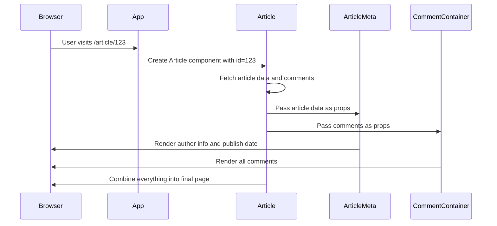

# Chapter 1: Component Architecture

Welcome to the first chapter of our journey through the `test1` project! Think of building a React application like constructing a house with LEGO blocks. Each LEGO piece serves a specific purpose - some are doors, some are windows, some are walls - and when you snap them together in the right way, you get a complete, functional house.

In React applications, these "LEGO blocks" are called **components**. Just like LEGO pieces, components are reusable building blocks that you can combine to create your entire application.

## Why Do We Need Components?

Imagine you're building a social media website. You need a navigation bar at the top, a login form, article cards to display posts, and user profile sections. Without components, you'd have to write the same HTML and JavaScript code over and over again for each page. That's like building each room of your house from scratch instead of using pre-made LEGO pieces!

Let's look at a concrete example: displaying an article on our blogging platform. We want to show the article title, content, author information, and comments. Instead of writing one giant piece of code, we'll break it into smaller, manageable components.

## What Are Components?

A **component** is a self-contained piece of code that:
- Displays some part of the user interface (UI)
- Can receive data from outside (called **props**)
- Can respond to user interactions (like clicks)
- Can be reused anywhere in your application

Think of a component like a smart LEGO block that knows how to display itself and react when someone interacts with it.

## Types of Components

### Simple Components
These are like basic LEGO blocks - they do one simple thing. For example, a button:

```jsx
const Button = () => {
  return <button>Click Me!</button>;
};
```

This component simply displays a button. It's small, focused, and reusable.

### Complex Components
These are like LEGO sets - they combine multiple smaller pieces. Looking at our project, the `Article` component is a great example:

```jsx
class Article extends React.Component {
  render() {
    return (
      <div className="article-page">
        <h1>{this.props.article.title}</h1>
        <ArticleMeta article={this.props.article} />
        <CommentContainer comments={this.props.comments} />
      </div>
    );
  }
}
```

This component combines a title, article metadata, and comments section into one complete article display.

## How Components Talk to Each Other: Props

Components receive information through **props** (short for properties). Think of props like labels on LEGO boxes that tell you what's inside and how to use them.

```jsx
<Header 
  appName="My Blog" 
  currentUser={user} 
/>
```

Here, we're passing two pieces of information to the `Header` component:
- `appName`: the name of our application
- `currentUser`: information about who's logged in

The `Header` component can then use this information to display the right navigation menu.

## Building Our Article Display: A Step-by-Step Example

Let's trace through how our article page works, starting from the top-level `App` component:

```jsx
// App.js - The main component
<Route path="/article/:id" component={Article} />
```

When someone visits `/article/123`, React loads the `Article` component.

```jsx
// Article component loads the data
componentWillMount() {
  this.props.onLoad(Promise.all([
    agent.Articles.get(this.props.match.params.id),
    agent.Comments.forArticle(this.props.match.params.id)
  ]));
}
```

The Article component fetches both the article data and its comments when it first loads.

```jsx
// Article component renders smaller components
render() {
  return (
    <div className="article-page">
      <h1>{this.props.article.title}</h1>
      <ArticleMeta article={this.props.article} canModify={canModify} />
      <CommentContainer 
        comments={this.props.comments} 
        currentUser={this.props.currentUser} 
      />
    </div>
  );
}
```

The Article component combines multiple smaller components, each handling one specific responsibility.

## How Components Work Under the Hood

Let's understand what happens when React renders our article page:



This diagram shows how components work together like an assembly line, each doing their part to create the final result.

## Component Responsibilities in Our Project

Looking at the actual code, let's see how different components handle different responsibilities:

### App Component - The Master Controller
```jsx
class App extends React.Component {
  render() {
    return (
      <div>
        <Header appName={this.props.appName} currentUser={this.props.currentUser} />
        <Switch>
          <Route exact path="/" component={Home}/>
          <Route path="/article/:id" component={Article} />
          <Route path="/login" component={Login} />
        </Switch>
      </div>
    );
  }
}
```

The `App` component is like the foreman of our construction site - it decides which components to show based on the current page.

### Header Component - Navigation Made Simple
```jsx
const LoggedInView = props => {
  if (props.currentUser) {
    return (
      <ul className="nav navbar-nav pull-xs-right">
        <li className="nav-item">
          <Link to="/editor">New Post</Link>
        </li>
        <li className="nav-item">
          <Link to="/settings">Settings</Link>
        </li>
      </ul>
    );
  }
  return null;
};
```

The `Header` component checks if a user is logged in and shows different navigation options accordingly. It's like a smart doorman that knows who's allowed where.

### Editor Component - Form Management
```jsx
class Editor extends React.Component {
  submitForm = ev => {
    ev.preventDefault();
    const article = {
      title: this.props.title,
      description: this.props.description,
      body: this.props.body
    };
    this.props.onSubmit(promise);
  };
}
```

The `Editor` component handles the complex task of letting users write and submit articles. It manages form inputs and coordinates with the [Redux State Management](02_redux_state_management_.md) system to save the data.

## The Component Lifecycle

Components in our project follow a predictable lifecycle:

1. **Mount**: Component is created and added to the page
2. **Update**: Component receives new props or user interactions
3. **Unmount**: Component is removed from the page

```jsx
// Article component lifecycle
componentWillMount() {
  // Load data when component is created
  this.props.onLoad(articlePromise);
}

componentWillUnmount() {
  // Clean up when component is removed
  this.props.onUnload();
}
```

This lifecycle ensures that components properly manage their resources and don't cause memory leaks.

## Putting It All Together

The beauty of component architecture is that each piece has a single, clear responsibility:

- `App`: Manages overall application structure and routing
- `Header`: Handles navigation and user authentication display  
- `Article`: Displays article content and coordinates sub-components
- `Editor`: Manages article creation and editing forms
- `Login`: Handles user authentication forms

Just like a well-organized LEGO set, each component knows its job and works together with others to create something amazing.

## Conclusion

Component architecture is the foundation that makes React applications maintainable and scalable. By breaking our application into small, focused pieces, we can:

- Reuse code across different parts of our app
- Test individual pieces in isolation
- Make changes without breaking other parts
- Collaborate with team members more effectively

Think of components as your reliable LEGO blocks - once you build them right, you can use them anywhere to create incredible applications.

In our next chapter, we'll explore how components communicate with each other and share data through [Redux State Management](02_redux_state_management_.md), which acts like the nervous system of our application, keeping all components synchronized and informed.

