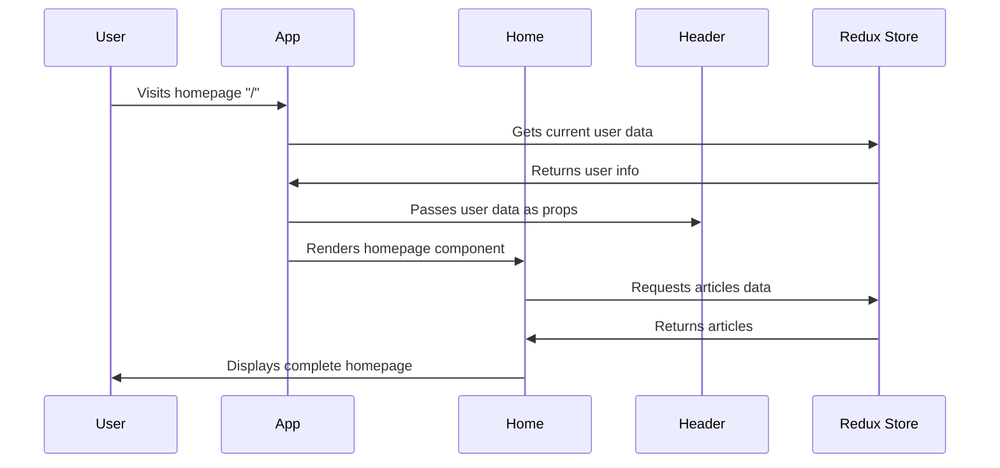

# Chapter 1: React Component Architecture

Welcome to the world of React development! In this chapter, we'll explore how React applications are built using a component architecture - think of it as building with LEGO blocks where each piece has a specific purpose and they all fit together to create something amazing.

## What Problem Does Component Architecture Solve?

Imagine you're building a blogging website. Without components, you'd have to write all your HTML, CSS, and JavaScript in one giant file - a nightmare to maintain! Component architecture solves this by breaking your application into small, reusable pieces, just like organizing your closet into different sections for shirts, pants, and shoes.

Let's say you want to build a simple blog homepage that shows:
- A navigation header
- A list of articles
- User profile information

Instead of cramming everything together, React lets you create separate components for each part and combine them like puzzle pieces.

## Key Concepts: The Building Blocks

### 1. Components Are Like Rooms in a House

Each component serves a specific purpose, just like rooms in a house:
- **Kitchen (Header component)**: Handles navigation and menus
- **Living Room (Home component)**: Displays the main content
- **Office (Profile component)**: Shows user information
- **Library (Article component)**: Displays individual articles

### 2. The App Component: Your House's Foundation

The App component is like the foundation and main structure of your house - it holds everything together and decides which rooms (components) to show:

```jsx
class App extends React.Component {
  render() {
    return (
      <div>
        <Header />
        <Home />
      </div>
    );
  }
}
```

This simple App component says: "Show the Header at the top, then show the Home component below it."

### 3. Props: Passing Notes Between Rooms

Components can communicate by passing props (properties) - think of them like passing notes between rooms:

```jsx
<Header 
  appName="My Blog" 
  currentUser={user} 
/>
```

Here we're passing two "notes" to the Header component: the app name and current user information.

## Building Our Blog Homepage: Step by Step

Let's see how our blog application uses components to create a complete homepage:

### Step 1: The App Component Orchestrates Everything

```jsx
// The main conductor of our application
<Switch>
  <Route exact path="/" component={Home}/>
  <Route path="/article/:id" component={Article} />
  <Route path="/@:username" component={Profile} />
</Switch>
```

The App component acts like a traffic director, deciding which component to show based on the URL. If someone visits the homepage ("/"), show the Home component. If they visit an article page, show the Article component.

### Step 2: Specialized Components Handle Specific Tasks

```jsx
// Home component focuses just on the homepage
class Home extends React.Component {
  render() {
    return (
      <div className="home-page">
        <Banner appName={this.props.appName} />
        <MainView />
        <Tags tags={this.props.tags} />
      </div>
    );
  }
}
```

The Home component is like a room decorator - it arranges smaller pieces (Banner, MainView, Tags) to create the perfect homepage layout.

### Step 3: Components Can Have Sub-Components

```jsx
// Article component includes smaller components
<div className="article-page">
  <ArticleMeta article={this.props.article} />
  <CommentContainer comments={this.props.comments} />
</div>
```

Just like a bedroom might have a closet and a bathroom, the Article component contains smaller components for displaying article metadata and comments.

## Under the Hood: How Components Come to Life

Let's trace what happens when someone visits your blog homepage:



### Step-by-Step Component Lifecycle

1. **User visits the homepage**: The browser loads your React app
2. **App component wakes up**: It checks the URL and decides to show the Home component
3. **Data flows down**: App component gets user information and passes it to child components via props
4. **Components render**: Each component creates its HTML based on the props it received
5. **User sees the result**: A beautiful, functional homepage appears

### The Magic Behind the Scenes

In our codebase, here's how the App component connects everything:

```jsx
// App.js - The master component
const mapStateToProps = state => {
  return {
    appName: state.common.appName,
    currentUser: state.common.currentUser
  };
};
```

This code connects the App component to the [Redux Store & State Management](02_redux_store___state_management_.md), allowing it to access shared data like the current user.

```jsx
// Passing data down to Header
<Header
  appName={this.props.appName}
  currentUser={this.props.currentUser} 
/>
```

The App component then passes this information down to the Header component, which uses it to show the right navigation options.

### Component Communication Pattern

```jsx
// Header.js - Uses props to decide what to show
const LoggedInView = props => {
  if (props.currentUser) {
    return (
      <ul className="nav navbar-nav">
        <li><Link to="/editor">New Post</Link></li>
        <li><Link to="/settings">Settings</Link></li>
      </ul>
    );
  }
  return null;
};
```

The Header component receives the `currentUser` prop and intelligently decides whether to show login buttons or user navigation options - it's like a smart doorman who knows whether you're a guest or a resident!

## Putting It All Together

React's component architecture creates a beautiful hierarchy where:
- **App component**: The wise parent that orchestrates everything
- **Page components** (Home, Article, Profile): Specialized rooms for different purposes  
- **UI components** (Header, Banner): Reusable pieces that appear throughout the app
- **Props**: The communication system that lets components share information

This architecture makes your code organized, reusable, and easy to maintain. When you need to update the header, you only touch the Header component. When you want to add a new page, you create a new component and tell the App component about it.

## What We've Learned

In this chapter, we discovered how React components work together like rooms in a well-organized house. Each component has a specific purpose, they communicate through props, and the App component orchestrates everything. This architecture makes building complex applications manageable and maintainable.

Next, we'll explore how components get their data and share information through the [Redux Store & State Management](02_redux_store___state_management_.md) system - the central nervous system that keeps all your components in sync!

