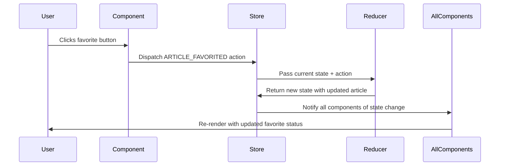

# Chapter 2: Redux State Management

Building on what we learned about [Component Architecture](01_component_architecture.md), you might be wondering: "How do all these components share data with each other?" Imagine if every LEGO piece had to remember its own color, size, and position separately - it would be chaos! 

In our previous chapter, we saw how components work like LEGO blocks. But what happens when your `Header` component needs to know if a user is logged in, your `ArticleList` needs to show different content based on that user, and your `Profile` component needs to display that same user's information? Without a central system, components would be passing data up and down like a game of telephone, leading to confusion and bugs.

This is where **Redux** comes to the rescue! Think of Redux as the central library system for your entire application.

## The Problem: Component Communication Chaos

Let's start with a concrete example. Imagine you're browsing our blogging platform and you want to "favorite" an article. Here's what needs to happen:

1. The article displays a heart button showing it's not favorited
2. You click the heart button
3. The heart turns red and the favorite count increases
4. If you navigate to your profile, this article should appear in your favorites list
5. The article list on the home page should also show this article as favorited

Without Redux, each component would need to manage its own copy of this data, leading to inconsistencies and complex prop-passing chains.

## What is Redux?

Redux is like a **city's central library system**. Just as a library has:

- **A central catalog** that knows about every book in the system
- **Librarians** who follow specific rules to organize and update the catalog
- **Request forms** that patrons fill out to make changes

Redux has three main parts:

- **Store**: The central catalog (holds all your app's data)
- **Reducers**: The librarians (organize and update data following specific rules)
- **Actions**: The request forms (tell the system what changes to make)

## The Three Core Concepts

### 1. The Store - Your App's Memory Bank

The **store** is a single JavaScript object that contains your entire application's state. Think of it as a giant filing cabinet where every piece of information your app needs is stored in one place.

```js
// Example of what our store might look like
{
  currentUser: { username: "john_doe", email: "john@example.com" },
  articles: [
    { title: "My First Post", favorited: true, favoritesCount: 5 },
    { title: "Learning Redux", favorited: false, favoritesCount: 2 }
  ],
  comments: ["Great article!", "Thanks for sharing!"]
}
```

This single store replaces the need for each component to remember its own data. Every component can access this shared information.

### 2. Actions - Request Forms for Changes

**Actions** are like request forms you fill out at the library. They describe *what* you want to change, but not *how* to change it. Actions are simple JavaScript objects with a `type` that describes what happened.

```js
// Action to favorite an article
{
  type: 'ARTICLE_FAVORITED',
  payload: {
    article: { slug: 'my-first-post', favorited: true, favoritesCount: 6 }
  }
}
```

This action says "Hey, someone favorited an article, here's the updated article data." It doesn't specify how to update the store - that's the reducer's job.

### 3. Reducers - The Librarians

**Reducers** are like librarians who know exactly how to organize the information. They take the current state and an action, then return a new state following specific rules.

```js
// Reducer that handles article favoriting
function articleReducer(state = {}, action) {
  if (action.type === 'ARTICLE_FAVORITED') {
    return {
      ...state,  // Keep everything else the same
      article: action.payload.article  // Update just the article
    };
  }
  return state;  // No changes for other action types
}
```

This reducer says "When someone favorites an article, update our article data with the new information."

## Solving Our Use Case: Favoriting an Article

Let's trace through what happens when a user clicks the favorite button on an article:



Here's what happens step by step:

1. **User clicks the favorite button** in the article component
2. **Component dispatches an action** to the store saying "this article was favorited"
3. **Store sends the action to the reducer** along with the current state
4. **Reducer calculates the new state** with the updated favorite information
5. **Store updates itself** with the new state
6. **All components automatically get the updated data** and re-render

## How Our Project Uses Redux

Let's look at how our blogging platform implements Redux, starting with the action types:

```js
// Action types - like form names at the library
export const ARTICLE_FAVORITED = 'ARTICLE_FAVORITED';
export const ARTICLE_UNFAVORITED = 'ARTICLE_UNFAVORITED';
export const LOGIN = 'LOGIN';
export const LOGOUT = 'LOGOUT';
```

These constants define all the different types of changes that can happen in our app. Think of them as different types of request forms.

### Creating Actions

When a user favorites an article, here's how we create the action:

```js
// This function creates an action
function favoriteArticle(slug) {
  return {
    type: 'ARTICLE_FAVORITED',
    payload: agent.Articles.favorite(slug)  // API call to server
  };
}
```

The component calls this function when the user clicks the favorite button. The `payload` contains a promise that will resolve with the updated article data from the server.

### Handling Actions with Reducers

Our project splits reducers into different files for organization. Here's how the article reducer handles favoriting:

```js
// article reducer - manages article-related state
export default (state = {}, action) => {
  switch (action.type) {
    case ARTICLE_FAVORITED:
      return {
        ...state,
        article: action.payload.article,  // Updated article data
        favorited: true
      };
    default:
      return state;  // No changes for unrecognized actions
  }
};
```

This reducer specifically handles article-related state changes. When it receives an `ARTICLE_FAVORITED` action, it updates the state with the new article information.

### Combining Multiple Reducers

Our app has different types of data (articles, users, comments), so we split them into separate reducers:

```js
// Combining all reducers into one
import { combineReducers } from 'redux';
import article from './reducers/article';
import auth from './reducers/auth';
import common from './reducers/common';

export default combineReducers({
  article,    // Manages current article state
  auth,       // Manages login/registration state
  common,     // Manages app-wide state like current user
});
```

Each reducer manages its own slice of the state, like different departments in our library system.

## Redux Middleware - The Processing Layer

Our project uses **middleware** - think of it as a processing layer that handles special actions before they reach the reducers:

```js
// Middleware that handles promises
const promiseMiddleware = store => next => action => {
  if (isPromise(action.payload)) {
    // Handle API calls automatically
    action.payload.then(
      result => {
        action.payload = result;
        store.dispatch(action);  // Send successful result to reducer
      }
    );
  } else {
    next(action);  // Pass regular actions through
  }
};
```

This middleware automatically handles API calls. When we dispatch an action with a promise (like our favorite article API call), the middleware waits for the server response and then sends the actual data to the reducer.

## Setting Up the Store

Here's how our project creates and configures the Redux store:

```js
// Creating the store with middleware
import { createStore, applyMiddleware } from 'redux';
import reducer from './reducer';
import { promiseMiddleware } from './middleware';

export const store = createStore(
  reducer,                    // Our combined reducer
  applyMiddleware(promiseMiddleware)  // Add promise handling
);
```

This creates our central "library system" with all the necessary processing capabilities.

## Connecting Components to Redux

Components don't directly access the store. Instead, they connect through a special system that:

1. **Maps state to props**: Components receive store data as props
2. **Maps actions to props**: Components receive action creators as props
3. **Automatically updates**: Components re-render when relevant store data changes

```js
// Component receives data and actions as props
class Article extends React.Component {
  handleFavorite = () => {
    // This calls the favoriteArticle action creator
    this.props.onFavorite(this.props.article.slug);
  };

  render() {
    const article = this.props.article;  // From Redux store
    return (
      <div>
        <h1>{article.title}</h1>
        <button onClick={this.handleFavorite}>
          {article.favorited ? '❤️' : '🤍'} {article.favoritesCount}
        </button>
      </div>
    );
  }
}
```

The component doesn't know or care that the data comes from Redux - it just receives props and calls functions, keeping the component simple and focused.

## The Complete Flow in Action

Let's trace through the complete favoriting process in our application:

1. **User sees an article** with a heart button showing 5 favorites
2. **User clicks the heart** - component calls `onFavorite(article.slug)`
3. **Action is dispatched** with type `ARTICLE_FAVORITED` and a promise payload
4. **Middleware intercepts** the action, sees the promise, and waits for the API response
5. **Server responds** with updated article data (favorited: true, favoritesCount: 6)
6. **Middleware dispatches** the action again with the actual data
7. **Reducer updates** the store with the new article information
8. **All components** that display this article automatically re-render
9. **User sees** the heart turn red and the count change to 6

This entire process ensures that every part of the app stays synchronized automatically.

## Benefits of This System

Redux's central library system provides several key benefits:

- **Consistency**: All components see the same data
- **Predictability**: Changes follow a clear, traceable path
- **Debugging**: You can see exactly what actions caused what changes
- **Time travel**: You can replay actions to reproduce bugs
- **Testing**: Each piece can be tested independently

## Conclusion

Redux transforms your application from a chaotic collection of components each managing their own data into an organized system where information flows predictably through a central hub. Just like a well-run library system, everything has its place and follows clear procedures.

The key concepts to remember:
- **Store**: Your app's single source of truth
- **Actions**: Descriptions of what changes should happen
- **Reducers**: Pure functions that calculate new state
- **Middleware**: Processing layer for complex operations

In our next chapter, we'll explore the [API Agent Layer](03_api_agent_layer.md), which handles the communication between our Redux store and the server, ensuring our local state stays synchronized with the backend data.

