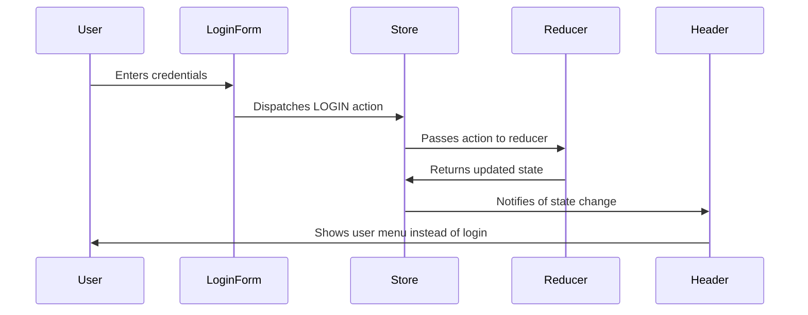

# Chapter 2: Redux Store & State Management

In the previous chapter, we learned about [React Component Architecture](01_react_component_architecture_.md) and how components communicate through props. But what happens when your blog app grows bigger? What if you have 20 components that all need to know who the current user is? Passing props through every single component becomes like playing a never-ending game of telephone - messy and error-prone.

This is where Redux Store & State Management comes to the rescue!

## What Problem Does Redux Store Solve?

Imagine you're managing a busy restaurant. Without a central communication system, the kitchen doesn't know what the dining room needs, the cashier can't tell if a table's order is ready, and chaos ensues. Everyone is shouting across the restaurant trying to stay updated!

Redux Store is like installing a central communication hub in your restaurant. All information flows through one place, and everyone who needs to know gets updated automatically. When a new order comes in, the kitchen knows immediately. When food is ready, the servers are notified instantly.

Let's say our blog app needs to:
- Show the current user's name in the header
- Display "My Articles" only if the user is logged in
- Show different navigation options based on user status
- Remember user preferences across different pages

Without Redux, you'd need to pass user data through every single component. With Redux, all components can access this information from one central place!

## Key Concepts: Building Your Data Management System

### 1. The Store: Your Application's Memory Bank

The Redux Store is like a bank vault that holds ALL your application's data in one secure place:

```js
// The store contains everything your app needs to remember
{
  currentUser: { name: "John", email: "john@blog.com" },
  articles: [...],
  appName: "My Blog",
  isLoading: false
}
```

Just like a bank vault, you can't just walk in and grab money - you need to follow proper procedures!

### 2. Actions: Formal Requests for Changes

Actions are like deposit/withdrawal slips at a bank. They describe what you want to do:

```js
// "I want to log in this user"
const loginAction = {
  type: 'LOGIN',
  payload: { user: userData }
};
```

This action says: "Hey Store, I want to perform a LOGIN operation with this user data."

### 3. Reducers: The Bank Tellers Who Process Requests

Reducers are like bank tellers who know exactly how to process each type of request:

```js
// The reducer processes the login request
function authReducer(state = {}, action) {
  if (action.type === 'LOGIN') {
    return { ...state, currentUser: action.payload.user };
  }
  return state;
}
```

The reducer says: "Oh, you want to LOGIN? Let me update the state to include this new current user."

## Building Our Blog's State Management: Step by Step

Let's see how our blog uses Redux to manage user authentication - a perfect example of data that many components need to access.

### Step 1: Setting Up the Central Store

```js
// store.js - Creating our application's memory bank
import { createStore } from 'redux';
import reducer from './reducer';

export const store = createStore(reducer);
```

This creates our central data vault where all application information will live. Think of it as setting up the bank's main computer system.

### Step 2: Defining What Can Happen (Action Types)

```js
// actionTypes.js - All possible operations in our app
export const LOGIN = 'LOGIN';
export const LOGOUT = 'LOGOUT';
export const APP_LOAD = 'APP_LOAD';
```

These are like having a menu of all possible banking operations - deposit, withdraw, transfer, etc. Our app can perform LOGIN, LOGOUT, or APP_LOAD operations.

### Step 3: Creating the State Structure

Let's look at how our app organizes its data:

```js
// Initial state - like setting up empty account books
const defaultState = {
  appName: 'Conduit',
  token: null,
  currentUser: null,
  viewChangeCounter: 0
};
```

This is our app's "account ledger" - it tracks the app name, user authentication token, current user info, and a counter for page changes.

## How Components Connect to the Store

Now let's see how our components actually use this centralized data:

### Step 1: Components Subscribe to Store Updates

```js
// App.js - Connecting to the data vault
const mapStateToProps = state => {
  return {
    appName: state.common.appName,
    currentUser: state.common.currentUser
  };
};
```

This is like giving the App component a "bank account statement" - it can see the current app name and user information whenever they change.

### Step 2: Components Dispatch Actions to Make Changes

```js
// When user logs in, send a request to update the store
dispatch({ 
  type: 'LOGIN', 
  payload: { user: userData } 
});
```

When a component wants to change something, it sends an action (like filling out a bank form) to request the change.

## Under the Hood: The Redux Data Flow

Let's trace what happens when a user logs into our blog:



### Step-by-Step Redux Flow

1. **User enters login credentials**: The user fills out the login form
2. **Component dispatches action**: The LoginForm component sends a LOGIN action to the store
3. **Store forwards to reducer**: The store asks the appropriate reducer to process this action
4. **Reducer updates state**: The reducer creates a new state with the logged-in user
5. **Store notifies components**: All connected components automatically receive the updated data
6. **Components re-render**: Header shows user menu, other components update accordingly

### The Magic of Automatic Updates

Here's how our common reducer handles the LOGIN action:

```js
// common.js reducer - Processing the login request
export default (state = defaultState, action) => {
  switch (action.type) {
    case LOGIN:
      return {
        ...state,
        token: action.payload.user.token,
        currentUser: action.payload.user
      };
    default:
      return state;
  }
};
```

When a LOGIN action arrives, this reducer:
1. Takes the current state
2. Creates a new state with the user's token and information
3. Returns the updated state

The `...state` part means "keep everything the same, except for what I'm specifically changing."

### Middleware: The Security Guards

Our app uses middleware - like security guards who check every transaction:

```js
// middleware.js - Handling special operations
const localStorageMiddleware = store => next => action => {
  if (action.type === LOGIN) {
    // Save login token to browser storage
    window.localStorage.setItem('jwt', action.payload.user.token);
  }
  next(action);  // Continue processing
};
```

This middleware says: "Whenever someone logs in, also save their authentication token to the browser so they stay logged in even if they refresh the page."

### Combining Multiple Reducers

Our app has different "departments" handling different types of data:

```js
// reducer.js - Combining all departments
export default combineReducers({
  article,     // Handles article data
  auth,        // Handles authentication
  common,      // Handles shared app data
  home,        // Handles homepage data
  profile      // Handles user profiles
});
```

It's like having different departments in a bank - loans, savings, checking accounts - each handling their specialty, but all part of the same bank.

## Putting It All Together: A Real Example

Let's see how everything works together when the app first loads:

```js
// App component connecting to Redux
class App extends React.Component {
  componentDidMount() {
    const token = window.localStorage.getItem('jwt');
    if (token) {
      // User was previously logged in, load their data
      this.props.onLoad(agent.Auth.current(), token);
    }
  }
}

const mapDispatchToProps = dispatch => ({
  onLoad: (payload, token) =>
    dispatch({ type: 'APP_LOAD', payload, token })
});
```

When the app starts:
1. **Check for saved login**: Look in browser storage for a login token
2. **Dispatch APP_LOAD action**: Send user data to the store
3. **Store updates state**: All components now know the current user
4. **Components render accordingly**: Header shows user menu, etc.

This happens automatically every time someone visits your blog - no need to manually check user status in every component!

## What We've Learned

In this chapter, we discovered how Redux Store acts as the central nervous system of our application:

- **The Store** holds all application data in one place
- **Actions** describe what changes we want to make
- **Reducers** process actions and update the state
- **Components** automatically receive updates when data changes
- **Middleware** handles special operations like saving to browser storage

This centralized approach means components don't need to pass data around like a game of telephone. Instead, they all connect to the same reliable source of truth, making your application predictable and maintainable.

Next, we'll explore how this data gets into our Redux Store in the first place through the [API Communication Layer](03_api_communication_layer_.md) - the system that talks to servers and brings fresh data into our application!

