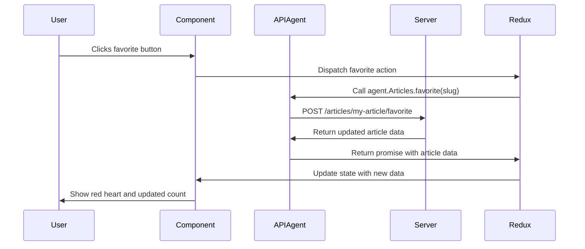
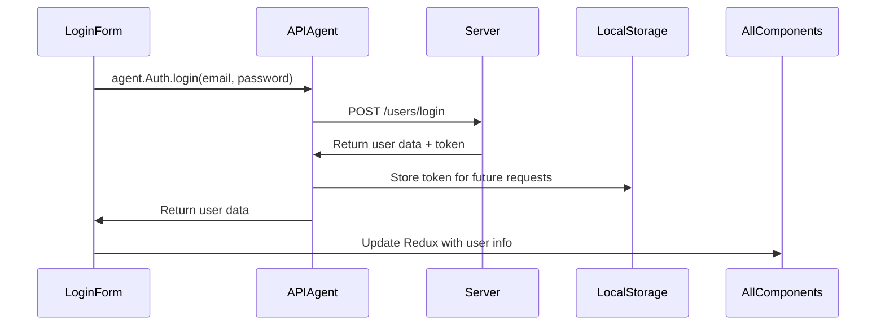

# Chapter 3: API Agent Layer

After learning about [Component Architecture](01_component_architecture.md) and [Redux State Management](02_redux_state_management.md), you might wonder: "How do components get their data from the server?" Imagine if every component in your React app had to figure out how to talk to different servers, handle authentication, and manage network errors on its own - it would be like every person in a city having to personally visit each store, bank, and office instead of using a postal service!

This is where the **API Agent Layer** becomes essential. Let's start with a concrete example: when you click the "favorite" button on an article in our blogging platform, your app needs to tell the server to save this preference, get the updated favorite count, and then update the UI. Without a centralized system, every component would need its own way to make these server requests.

## The Problem: Scattered API Calls Everywhere

Imagine you're building features for our blogging platform. You need to:

- Log in a user and get their profile information
- Fetch a list of articles for the home page
- Save a new article when someone clicks "Publish"
- Add a comment to an article
- Update the user's profile settings

Without an API Agent, each component would handle server communication differently:

```jsx
// BAD: Each component making its own API calls
class LoginForm extends React.Component {
  handleSubmit = () => {
    fetch('https://api.example.com/users/login', {
      method: 'POST',
      headers: { 'Content-Type': 'application/json' },
      body: JSON.stringify({ email, password })
    }).then(response => response.json())
      .then(data => { /* handle response */ });
  };
}
```

This approach leads to problems:
- **Duplication**: Every component repeats the same API setup code
- **Inconsistency**: Different components might handle errors differently
- **Hard to change**: If the server URL changes, you need to update dozens of files
- **Authentication chaos**: Managing login tokens becomes a nightmare

## What is an API Agent?

An **API Agent** is like a **centralized postal service** for your application. Just as you don't need to know the details of how mail gets delivered - you just drop it in a mailbox and trust the postal service to handle routing, sorting, and delivery - your components don't need to know the details of server communication.

The API Agent provides a simple interface like:
```js
// Simple, clean interface for components
agent.Auth.login('user@example.com', 'password123');
agent.Articles.getAll();
agent.Comments.create(articleId, 'Great article!');
```

## Core Concepts of Our API Agent

### 1. Centralized Configuration

All API settings live in one place, making changes easy:

```js
const API_ROOT = 'https://conduit.productionready.io/api';

const requests = {
  get: url => fetch(`${API_ROOT}${url}`),
  post: (url, body) => fetch(`${API_ROOT}${url}`, { 
    method: 'POST', 
    body: JSON.stringify(body) 
  })
};
```

This central configuration means if you need to change the server URL or add headers, you update one place instead of hunting through dozens of components.

### 2. Organized by Feature

Instead of one giant API object, we organize methods by what they do:

```js
const Auth = {
  login: (email, password) => { /* login logic */ },
  register: (username, email, password) => { /* registration logic */ },
  getCurrentUser: () => { /* get current user info */ }
};

const Articles = {
  getAll: () => { /* fetch all articles */ },
  create: (article) => { /* create new article */ },
  favorite: (slug) => { /* favorite an article */ }
};
```

This organization makes it easy to find the right method and keeps related functionality together.

### 3. Automatic Authentication

The agent handles authentication tokens automatically:

```js
let token = null;

const addAuthHeader = (request) => {
  if (token) {
    request.headers['Authorization'] = `Token ${token}`;
  }
};
```

Components never worry about managing login tokens - the agent handles it behind the scenes.

## Solving Our Use Case: Favoriting an Article

Let's trace through what happens when a user clicks the favorite button, showing how the API Agent simplifies the process:



Here's what happens step by step:

1. **User clicks favorite** - Component receives the click
2. **Component dispatches action** - Calls Redux action creator
3. **Redux calls API Agent** - `agent.Articles.favorite('my-article-slug')`
4. **Agent makes HTTP request** - Handles URL, headers, authentication automatically
5. **Server responds** - Returns updated article with new favorite count
6. **Agent returns data** - Passes clean data back to Redux
7. **Redux updates state** - Components re-render with new data

## How Our Project Implements the API Agent

Let's explore the actual implementation, starting with the basic setup:

### Setting Up HTTP Requests

Our agent uses a library called `superagent` to make HTTP requests easier:

```js
import superagentPromise from 'superagent-promise';
import _superagent from 'superagent';

const superagent = superagentPromise(_superagent, global.Promise);
```

This setup gives us a promise-based HTTP client that's easier to work with than the browser's built-in `fetch`.

### Creating the Request Foundation

We build a foundation for all API calls:

```js
const API_ROOT = 'https://conduit.productionready.io/api';

const requests = {
  get: url => 
    superagent.get(`${API_ROOT}${url}`).then(res => res.body),
  post: (url, body) => 
    superagent.post(`${API_ROOT}${url}`, body).then(res => res.body)
};
```

This foundation handles:
- **Base URL**: Every request automatically gets the right server address
- **Response parsing**: Automatically extracts the data from server responses
- **Promise handling**: Returns promises that work nicely with Redux

### Adding Authentication

Authentication gets handled automatically with a plugin system:

```js
let token = null;

const tokenPlugin = req => {
  if (token) {
    req.set('authorization', `Token ${token}`);
  }
};

const requests = {
  get: url =>
    superagent.get(`${API_ROOT}${url}`)
      .use(tokenPlugin)  // Automatically adds auth token
      .then(responseBody)
};
```

When a user logs in, we store their token once, and every subsequent request automatically includes it.

## Feature-Organized API Methods

### Authentication Methods

All login and registration functionality is grouped together:

```js
const Auth = {
  current: () => requests.get('/user'),
  
  login: (email, password) =>
    requests.post('/users/login', { 
      user: { email, password } 
    }),
    
  register: (username, email, password) =>
    requests.post('/users', { 
      user: { username, email, password } 
    })
};
```

Components use these methods without knowing the server endpoints:
```js
// In a component
agent.Auth.login('john@example.com', 'mypassword')
  .then(user => console.log('Logged in!', user));
```

### Article Management

All article-related operations are grouped together:

```js
const Articles = {
  all: page => 
    requests.get(`/articles?limit=10&offset=${page * 10}`),
    
  get: slug => 
    requests.get(`/articles/${slug}`),
    
  create: article => 
    requests.post('/articles', { article }),
    
  favorite: slug => 
    requests.post(`/articles/${slug}/favorite`)
};
```

This organization makes it easy for developers to find the right method and understand what's available.

### Comment Operations

Comments get their own organized section:

```js
const Comments = {
  forArticle: slug => 
    requests.get(`/articles/${slug}/comments`),
    
  create: (slug, comment) => 
    requests.post(`/articles/${slug}/comments`, { comment }),
    
  delete: (slug, commentId) => 
    requests.del(`/articles/${slug}/comments/${commentId}`)
};
```

## How Components Use the Agent

Components interact with the API Agent through Redux actions, keeping the UI code clean:

```js
// Redux action creator uses the agent
const loadArticle = (slug) => ({
  type: 'LOAD_ARTICLE',
  payload: agent.Articles.get(slug)  // API call returns a promise
});

// Component dispatches the action
class Article extends React.Component {
  componentDidMount() {
    this.props.dispatch(loadArticle(this.props.slug));
  }
}
```

The component doesn't know or care about server URLs, authentication, or error handling - it just asks for what it needs.

## Under the Hood: Authentication Flow

Let's trace through what happens when a user logs in:



1. **Login form** calls `agent.Auth.login(email, password)`
2. **Agent makes request** to `/users/login` endpoint
3. **Server validates** credentials and returns user data plus authentication token
4. **Agent stores token** for automatic use in future requests
5. **Agent returns** clean user data to the component
6. **Component updates** Redux store, causing all components to see the logged-in user

## Error Handling and Retry Logic

The API Agent can also handle errors centrally:

```js
const requests = {
  get: url =>
    superagent.get(`${API_ROOT}${url}`)
      .use(tokenPlugin)
      .then(responseBody)
      .catch(err => {
        if (err.status === 401) {
          // Automatically handle "unauthorized" errors
          store.dispatch(logout());
        }
        throw err;  // Re-throw for component to handle
      })
};
```

This central error handling means unauthorized users get automatically logged out, regardless of which component made the failing request.

## Putting It All Together

Here's how all the pieces work together for our article favoriting example:

```js
// 1. Component triggers the action
<button onClick={() => this.props.onFavorite(article.slug)}>
  ❤️ {article.favoritesCount}
</button>

// 2. Redux action uses the agent
const favoriteArticle = (slug) => ({
  type: 'ARTICLE_FAVORITED',
  payload: agent.Articles.favorite(slug)  // Clean API call
});

// 3. Agent handles the server communication
const Articles = {
  favorite: slug => 
    requests.post(`/articles/${slug}/favorite`)  // All details handled
};
```

The component just calls a function, Redux coordinates the data flow, and the Agent handles all the messy server communication details.

## Benefits of the API Agent Pattern

The API Agent pattern provides several key advantages:

- **Single source of truth**: All API configuration lives in one place
- **Easy testing**: You can mock the entire API with a single object
- **Consistent error handling**: All requests follow the same error patterns
- **Authentication transparency**: Components never worry about auth tokens
- **Easy refactoring**: Change server endpoints without touching components
- **Clear organization**: Related API calls are grouped logically

## Conclusion

The API Agent Layer acts as your application's postal service, handling all the complex details of server communication while providing a clean, simple interface to your components. Just like you don't need to understand mail sorting systems to send a letter, your components don't need to understand HTTP headers, authentication, or server endpoints to get their data.

Key concepts to remember:
- **Centralized configuration**: All API settings in one place
- **Feature organization**: Related methods grouped together  
- **Automatic authentication**: Tokens handled transparently
- **Clean interfaces**: Components use simple method calls
- **Error handling**: Consistent behavior across the entire app

The API Agent completes our application architecture triangle: [Component Architecture](01_component_architecture.md) handles the UI building blocks, [Redux State Management](02_redux_state_management.md) coordinates data flow between components, and the API Agent manages all server communication. Together, these three layers create a robust, maintainable application structure that scales as your project grows.

