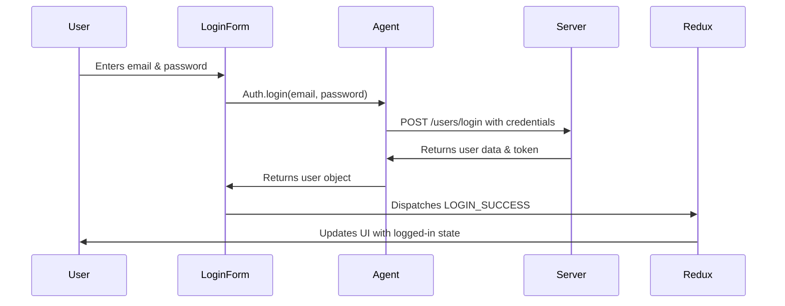

# Chapter 3: API Communication Layer

In the previous chapter, we learned about [Redux Store & State Management](02_redux_store___state_management_.md) and how all our application data is stored in one central place. But here's the thing - your Redux store starts empty! It's like having a beautiful library with empty shelves. How do we fill those shelves with books (data)?

This is where the API Communication Layer comes to the rescue!

## What Problem Does the API Communication Layer Solve?

Imagine you're running a news blog, and you want to show the latest articles to your readers. The articles aren't stored on your computer - they live on a server somewhere on the internet. You need a way to:

- Ask the server: "Hey, can you send me all the latest articles?"
- Tell the server: "This user wants to log in with these credentials"
- Request: "Please save this new article the user just wrote"

Without an API Communication Layer, every component would need to know how to talk to servers, handle authentication, deal with network errors, and format requests properly. It would be like every person in your office needing to know how to operate the postal system, handle international shipping codes, and manage delivery tracking!

The API Communication Layer is like having a professional postal service for your app. You simply say "deliver this message" and it handles all the complex details of packaging, addressing, sending, and delivering responses back to you.

## Key Concepts: Building Your Postal Service

### 1. The Agent: Your Personal Mail Carrier

The agent is like a smart mail carrier who knows exactly how to deliver different types of messages:

```js
// Your agent knows how to handle different types of requests
const agent = {
  Auth: { login, register, getCurrentUser },
  Articles: { getAll, create, delete },
  Comments: { create, delete, getForArticle }
};
```

Instead of learning complex postal codes and shipping procedures, you just tell your agent: "Please log in this user" or "Please get all articles," and they handle everything!

### 2. Authentication Tokens: Your ID Badge

When you log into the blog, you get a special token (like an ID badge) that proves who you are:

```js
// Setting your ID badge so the server recognizes you
agent.setToken(userToken);
```

The agent automatically attaches this "ID badge" to every request, so the server knows it's really you asking for your personal data or trying to create a new article.

### 3. Request Types: Different Types of Mail

Just like the postal service handles letters, packages, and express mail differently, our agent handles different HTTP request types:

- **GET requests**: "Please send me some information" (like requesting a catalog)
- **POST requests**: "Please create something new" (like submitting an application)
- **PUT requests**: "Please update existing information" (like changing your address)
- **DELETE requests**: "Please remove something" (like canceling a subscription)

## Building Our Blog's Communication System: Step by Step

Let's see how our blog app uses the API Communication Layer to handle user login - a perfect example that shows how all the pieces work together.

### Step 1: Setting Up the Basic Infrastructure

```js
// The foundation - how to talk to servers
const API_ROOT = 'https://myblog.com/api';

const requests = {
  get: url => fetch(`${API_ROOT}${url}`).then(res => res.json()),
  post: (url, data) => fetch(`${API_ROOT}${url}`, {
    method: 'POST',
    body: JSON.stringify(data)
  }).then(res => res.json())
};
```

This sets up the basic "postal infrastructure" - it knows the server address and how to send different types of messages. Think of it as establishing the postal service's main office and delivery trucks.

### Step 2: Creating Specialized Services

```js
// Authentication service - handles all login/logout operations
const Auth = {
  login: (email, password) =>
    requests.post('/users/login', { user: { email, password } }),
  
  getCurrentUser: () =>
    requests.get('/user'),
    
  register: (username, email, password) =>
    requests.post('/users', { user: { username, email, password } })
};
```

The Auth service is like having a specialized department that only handles identity verification. You don't need to know the complex details - just call `Auth.login(email, password)` and it handles everything!

### Step 3: Automatic Authentication Handling

```js
// Smart token management - like automatically showing your ID
let userToken = null;

const addAuthToRequest = request => {
  if (userToken) {
    request.headers.authorization = `Token ${userToken}`;
  }
  return request;
};
```

Once you log in, the agent remembers your "ID badge" and automatically shows it with every request. You never have to worry about manually adding authentication - it's handled automatically!

## How Components Use the Communication Layer

Now let's see how our [React Component Architecture](01_react_component_architecture_.md) actually uses this postal service:

### Step 1: Components Make Simple Requests

```js
// Login component - simple and clean
class LoginPage extends React.Component {
  handleLogin = async (email, password) => {
    try {
      const user = await agent.Auth.login(email, password);
      // Success! Update the Redux store
      this.props.onLogin(user);
    } catch (error) {
      // Handle error (show message to user)
      this.props.onError(error.message);
    }
  };
}
```

The component doesn't need to know about HTTP headers, server URLs, or error codes. It just says "please log in this user" and handles the result - success or failure.

### Step 2: Integration with Redux Store

```js
// Connecting the communication layer to state management
const mapDispatchToProps = dispatch => ({
  onLogin: (user) => dispatch({ 
    type: 'LOGIN_SUCCESS', 
    payload: { user } 
  }),
  onError: (message) => dispatch({ 
    type: 'LOGIN_ERROR', 
    payload: { message } 
  })
});
```

When the API call succeeds, the component updates the [Redux Store & State Management](02_redux_store___state_management_.md) with the new user data. This automatically updates all other components that need to know about the logged-in user!

## Under the Hood: The API Communication Flow

Let's trace what happens when a user tries to log into our blog:



### Step-by-Step Communication Flow

1. **User enters credentials**: User types email and password in the login form
2. **Component calls agent**: LoginForm calls `agent.Auth.login(email, password)`
3. **Agent formats request**: Agent packages the data properly and adds necessary headers
4. **Server processes request**: Server validates credentials and sends back user data
5. **Agent handles response**: Agent extracts the important data and passes it back
6. **Component updates store**: LoginForm sends the user data to Redux
7. **App updates automatically**: All components receive the new state and update accordingly

### The Magic of Request Formatting

Here's how the agent automatically handles the complex details:

```js
// The agent handles all the messy HTTP details
const tokenPlugin = req => {
  if (token) {
    req.set('authorization', `Token ${token}`);
  }
};

const requests = {
  post: (url, body) =>
    superagent
      .post(`${API_ROOT}${url}`, body)
      .use(tokenPlugin)  // Automatically add authentication
      .then(responseBody)  // Extract just the data we need
};
```

The agent automatically:
- Adds the correct server URL
- Includes authentication headers if the user is logged in
- Extracts just the data portion from the server response
- Handles the promise-based asynchronous nature of network requests

### Error Handling Made Simple

```js
// Components get clean success/error handling
try {
  const articles = await agent.Articles.getAll();
  // Success - articles contains the data
  dispatch({ type: 'ARTICLES_LOADED', payload: articles });
} catch (error) {
  // Error - something went wrong
  dispatch({ type: 'ARTICLES_ERROR', payload: error.message });
}
```

Components don't need to understand HTTP status codes or network timeouts. They just get a simple success (data) or failure (error message) result.

### Real-World Example: Loading Homepage Articles

Let's see how our Home component loads articles when the page first appears:

```js
// Home component using the communication layer
class Home extends React.Component {
  componentDidMount() {
    // Load articles when component appears
    this.loadArticles();
  }
  
  loadArticles = async () => {
    this.props.onLoadStart();  // Show loading spinner
    
    try {
      const articlesData = await agent.Articles.getAll();
      this.props.onLoadSuccess(articlesData);
    } catch (error) {
      this.props.onLoadError(error.message);
    }
  };
}
```

This component:
1. **Starts loading**: Shows a spinner to indicate data is being fetched
2. **Makes API call**: Uses the agent to request articles from the server
3. **Handles result**: Updates Redux store with either the articles data or an error message
4. **UI updates automatically**: Other components see the new state and update accordingly

### Advanced Features: Smart Caching and Optimization

Our agent can also include smart features like automatic retry and caching:

```js
// Smart article management
const Articles = {
  all: page => 
    requests.get(`/articles?limit=10&offset=${page * 10}`),
    
  byTag: (tag, page) =>
    requests.get(`/articles?tag=${tag}&limit=10&offset=${page * 10}`),
    
  create: article =>
    requests.post('/articles', { article }),
    
  update: article =>
    requests.put(`/articles/${article.slug}`, { article })
};
```

The Articles service provides simple methods like `Articles.all()` and `Articles.byTag(tag)`, but behind the scenes it:
- Formats URLs with proper pagination
- Handles different query parameters
- Manages the request/response cycle
- Provides consistent error handling

## Putting It All Together: A Complete Example

Let's see how everything works together when a user creates a new blog article:

```js
// Article editor component
class ArticleEditor extends React.Component {
  handleSubmit = async (articleData) => {
    this.setState({ isSubmitting: true });
    
    try {
      const newArticle = await agent.Articles.create(articleData);
      
      // Success! Redirect to the new article page
      this.props.history.push(`/article/${newArticle.slug}`);
      
      // Update Redux store with the new article
      this.props.onArticleCreated(newArticle);
      
    } catch (error) {
      // Show error message to user
      this.setState({ 
        errors: error.message,
        isSubmitting: false 
      });
    }
  };
}
```

This flow demonstrates the power of the API Communication Layer:
1. **Simple interface**: Component just calls `agent.Articles.create()`
2. **Automatic authentication**: Agent adds user token automatically
3. **Clean error handling**: Component gets simple success/error results
4. **State management integration**: Success updates Redux store
5. **UI updates**: Loading states and error messages work seamlessly

The component doesn't need to know about HTTP methods, server endpoints, authentication headers, or response parsing - the API Communication Layer handles all these details!

## What We've Learned

In this chapter, we discovered how the API Communication Layer acts as a professional postal service for our application:

- **The Agent** provides simple methods like `login()` and `getArticles()` that hide HTTP complexity
- **Automatic authentication** means components never worry about tokens or headers  
- **Clean error handling** gives components simple success/failure results
- **Integration with Redux** means API data flows seamlessly into application state
- **Consistent interface** makes it easy to add new API calls without learning new patterns

This abstraction layer means your components can focus on user interface logic while the communication layer handles all the messy details of talking to servers. It's like having a professional translator who speaks both "React component" and "server API" languages fluently!

The API Communication Layer works hand-in-hand with our [React Component Architecture](01_react_component_architecture_.md) and [Redux Store & State Management](02_redux_store___state_management_.md) to create a complete, maintainable system where data flows smoothly from servers to user interfaces and back again.

