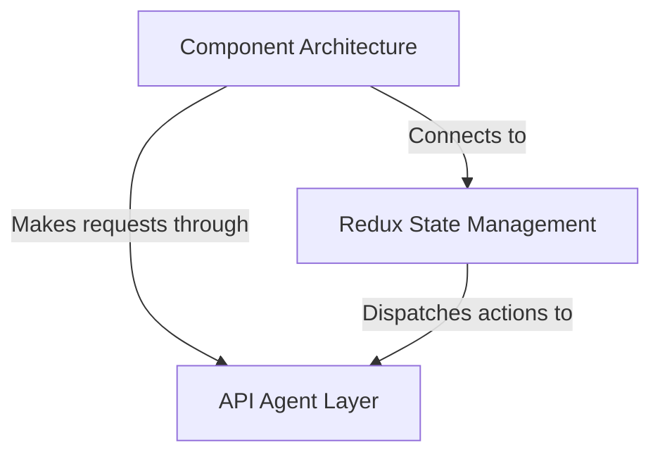

# Tutorial: test1

This is a **React-based blogging platform** called *Conduit* that allows users to create, read, and interact with articles. 
The application uses **Redux for state management** to keep track of user authentication, articles, comments, and UI state in a centralized store. 
Users can *sign up, log in, write articles, follow other users, and favorite posts* through a clean, component-based interface that communicates with a backend API.

**Source Repository:** [https://github.com/joyrahaASC/react-redux-realworld-example-app/tree/test1](https://github.com/joyrahaASC/react-redux-realworld-example-app/tree/test1)

## Chapters

1. [Component Architecture
](01_component_architecture_.md)
2. [Redux State Management
](02_redux_state_management_.md)
3. [API Agent Layer
](03_api_agent_layer_.md)
