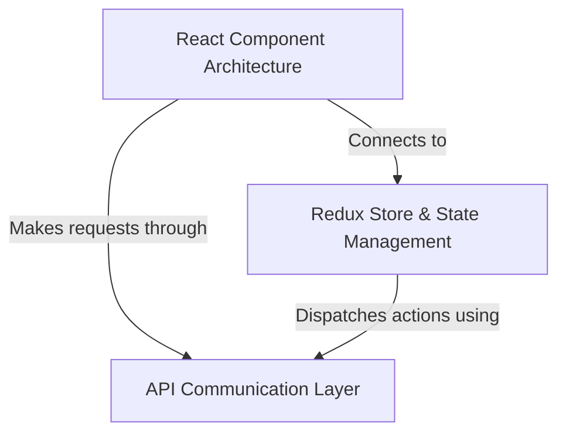

# Tutorial: 

This is a **React-based blogging platform** called Conduit that allows users to read, write, and interact with articles. 
The application uses **Redux for state management** to keep track of user authentication, articles, and comments across 
the entire app. Users can *sign up, log in, create articles, follow other users, and favorite posts* they enjoy. 
The frontend communicates with a backend API to *persist all data* and ensure users can access their content from anywhere.

**Source Repository:** [https://github.com/joyrahaASC/react-redux-realworld-example-app/](https://github.com/joyrahaASC/react-redux-realworld-example-app/)

## Chapters

1. [React Component Architecture
](01_react_component_architecture_.md)
2. [Redux Store & State Management
](02_redux_store___state_management_.md)
3. [API Communication Layer
](03_api_communication_layer_.md)
